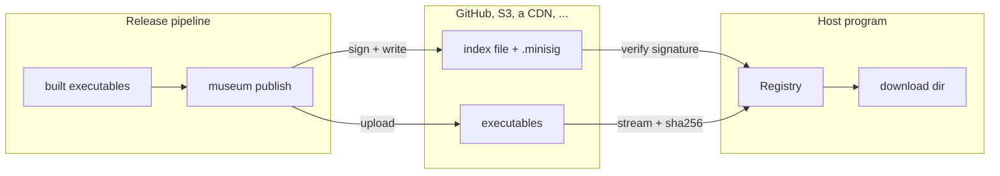

<p align="center">
  
</p>

<h1 align="center">museum</h1>

<p align="center">
  A registry for executables your program downloads at runtime.<br>
  Signed index, semver resolution, per-target builds, atomic installs.
</p>

<p align="center">
  <a href="https://crates.io/crates/museum"></a>
  <a href="https://docs.rs/museum"></a>
  
  
</p>

---

Some programs are extended by other programs. A host starts separate executables (drivers, plugins, agents) that are released on their own schedule, for several platforms. **museum** is the library both sides use:

- **The host** asks for `modbus ^0.4`. museum picks the newest version that fits, has a build for the host's exact target triple and speaks the host's interface version. It then downloads the build, proves it is the file the publisher signed, and installs it atomically.
- **The release pipeline** runs `museum publish`. It adds the new version to the index, refuses to change an already published one, signs the index, and uploads everything.

Where the executables live, where the index lives, and what the index file looks like are three separate choices. GitHub, JSON, YAML and TOML are built in; each can be replaced by your own type.

## Contents

- [How it works](#how-it-works)
- [Install](#install)
- [Fetching from a host](#fetching-from-a-host)
- [Publishing with the CLI](#publishing-with-the-cli)
- [Bring your own store, index store or format](#bring-your-own-store-index-store-or-format)
- [Guarantees](#guarantees)
- [Layout on GitHub](#layout-on-github)
- [Examples](#examples)
- [Features](#features)
- [Development](#development)

## How it works



`Registry<S, X>` is the one type a host touches.

| Piece | Trait | Decides | Built in |
|---|---|---|---|
| `S` | `Store` | where the executables live and how access is obtained | `GithubReleases` |
| `X` | `ReleaseIndex` | the format of the index file | `Json`, `Yaml`, `Toml` |
| `X::Store` | `IndexStore` | where that one index file lives | `gh.release_file(..)`, `gh.file(..)`, `HttpFile`, `LocalFile` |

Everything that must hold for every combination lives in the core, written once: bootstrapping access, signature checks, version resolution, hashing, the download cache and atomic installs.

## Install

```sh
cargo add museum                 # the library
cargo install museum-cli         # the `museum` command for release pipelines
```

## Fetching from a host

```rust
use museum::{HOST_TARGET, Json, Options, PublicKey, Registry, VersionReq};
use museum::github::Github;

// The publisher's public key: one of `public_keys` in the museum.toml that `museum init` wrote.
const PUBLISHER_KEY: &str = "RW...";

#[tokio::main]
async fn main() -> Result<(), Box<dyn std::error::Error>> {
    let gh = Github::public("acme", "plugins").prefix("acme-");   // Github::private(owner, repo, "GITHUB_TOKEN")
    let index = Json::new(gh.file("main", "registry/index.json"));  // or gh.release_file("index", "index.json")
    let options = Options {
        trusted_keys: vec![PublicKey::from_base64(PUBLISHER_KEY)?],
        download_dir: "drivers".into(), // relative paths resolve against the current directory, once
    };
    let registry = Registry::github(&gh, index, options)?;

    let wanted = [
        ("modbus".to_string(), VersionReq::parse("^0.4")?),
        ("modbus".to_string(), VersionReq::parse(">=0.4.1")?), // merged with the line above
        ("opcua".to_string(), VersionReq::STAR),
    ];
    for (package, fetched) in registry.fetch_all(&wanted, HOST_TARGET, 2).await {
        println!("{package}: {:?}", fetched.map(|f| f.path));
    }
    Ok(())
}
```

What `fetch_all` does:

1. Reads the index file and its signature from the index store once, verifies the signature against your trusted keys, then decodes it.
2. Resolves **one version per package** that satisfies every requirement for that package. Two requirements that no single version satisfies give `Unresolvable::Conflict`.
3. Bootstraps the executables store once and shares the session. If the store answers "unauthorized", museum bootstraps again once and retries.
4. Downloads each package once, in parallel, into `<package>-<version>[.exe]`, and returns typed errors you can match on.

`HOST_TARGET` is Cargo's exact target triple, so `x86_64-pc-windows-msvc` and `x86_64-pc-windows-gnu` are told apart. To set a timeout or proxy, pass your own client: `Github::public(..).client(reqwest_client)`.

## Publishing with the CLI

```sh
# once per registry: creates a signing key, museum.toml and an empty signed index
export GITHUB_TOKEN=$(gh auth token)
export MUSEUM_KEY_PASSWORD=...        # protects the generated secret key
museum init --registry https://github.com/acme/plugins --index index.yaml --prefix acme- \
  --secret-key ~/.config/museum/acme-plugins.key   # keep it out of the repository
  # add --index-branch main to commit the index to the repository instead of the `index` release

# every release
museum publish --package modbus --version 0.4.2 --interface 2 \
  --file x86_64-unknown-linux-gnu=target/x86_64-unknown-linux-gnu/release/modbus \
  --file x86_64-pc-windows-msvc=target/x86_64-pc-windows-msvc/release/modbus.exe
```

`museum init` writes this `museum.toml`. Commit it: it holds only public information.

```toml
registry = "https://github.com/acme/plugins"
index = "index.yaml"
prefix = "acme-"
public_keys = ["RWT..."]                            # give these to your hosts
secret_key = "/home/you/.config/museum/acme-plugins.key"   # a path, never the key
api_url = "https://api.github.com"                  # or a GitHub Enterprise API root
token_env = "GITHUB_TOKEN"
# index_branch = "main"                             # index committed to the repository
```

`museum publish` verifies the current index, refuses to change a version that is already published, uploads the executables, and writes the re-signed index last. A host therefore never sees an index entry whose file is missing. Publishing the same files again is a no-op.

The same flow is available from Rust as `Registry::init` and `Registry::publish`.

## Bring your own store, index store or format

**A store** says where executables live. Bootstrapping is per store type, and only `Registry` calls it. Implement `StoreWriter` too if `publish` should upload to it.

```rust
use museum::{Artifact, ByteStream, Location, Store};

struct S3Releases { /* bucket, client, prefix */ }

impl Store for S3Releases {
    type Session = Credentials;  // whatever bootstrap produces
    type Error = S3Error;        // implements StoreError: unauthorized(), not_found()

    async fn bootstrap(&self) -> Result<Credentials, S3Error> { /* fetch credentials */ }
    async fn open(&self, session: &Credentials, artifact: Artifact<'_>) -> Result<ByteStream<S3Error>, S3Error> {
        /* stream the object at self.location(artifact) */
    }
    fn location(&self, artifact: Artifact<'_>) -> Location { /* pure: { group, file } */ }
}
```

**An index store** finds and keeps one index file and its `.minisig`.

```rust
use museum::{IndexStore, Signed};

#[derive(Clone)]
struct S3File { /* bucket, key */ }

impl IndexStore for S3File {
    type Error = S3Error;        // implements IndexError: not_found()
    async fn read(&self) -> Result<Signed, S3Error> { /* index bytes + optional signature */ }
    async fn write(&self, signed: Signed) -> Result<Vec<String>, S3Error> { /* both files */ }
}
```

**A format** is a file format and nothing else. It holds the index store it lives in, and the value you pass to `Registry::new` is the empty index.

```rust
use museum::{Release, ReleaseIndex, Version};

#[derive(Clone)]
struct Protobuf<S> { store: S, /* releases */ }

impl<S: IndexStore> ReleaseIndex for Protobuf<S> {
    type Store = S;
    type Error = DecodeError;
    fn store(&self) -> &S { &self.store }
    fn decode(&self, bytes: &[u8]) -> Result<Self, DecodeError> { /* ... */ }
    fn encode(&self) -> Result<Vec<u8>, DecodeError> { /* ... */ }
    fn packages(&self) -> Vec<String> { /* ... */ }
    fn releases(&self, package: &str) -> Vec<(Version, Release)> { /* ... */ }
    fn insert(&mut self, package: &str, version: Version, release: Release) { /* ... */ }
}

let registry = Registry::new(S3Releases::new(), Protobuf::new(S3File::new()), options)?;
```

Errors stay typed all the way: `RegistryError<S, X>` carries your store's, your format's and your index store's own error types, so a host can match on them.

## Guarantees

| Guarantee | How |
|---|---|
| The index came from the publisher | minisign (Ed25519) signature over the raw index bytes, checked before decoding. Several trusted keys are accepted, so a key can be rotated. A missing signature is refused; there is no unsigned fallback. |
| A file is the one the index lists | sha256 is computed while streaming, and compared before the file gets its real name. |
| A failed download leaves nothing runnable | Bytes land in `<name>.part` and are renamed into place only after the digest matches. Every failure path removes the `.part`. |
| Cached files are not trusted blindly | An existing file is re-hashed. A damaged or different build is downloaded again and overwritten. |
| Published versions are immutable | `publish` refuses a version that exists with different files. |
| Executables run on Unix | Installed with mode `0755`. |

Not covered in this version: rollback protection, meaning an attacker serving an older but validly signed index.

## Layout on GitHub

```
executables     release `<package>-v<version>`   asset <prefix><package>-<version>-<target>[.exe]
index           gh.release_file(tag, name)        asset <name> + <name>.minisig of release <tag>
                gh.file(branch, path)             <path> + <path>.minisig committed on <branch>
```

`.exe` is added when the **target** contains `windows`, so a Linux pipeline can publish Windows builds. One repository can host several registries at once as long as their index files and prefixes differ. This repository does exactly that for its examples.

The built-in formats share one model, `package → version → release`:

```yaml
modbus:
  0.4.2:
    interface: 2
    targets:
      x86_64-pc-windows-msvc:    { sha256: 9f2c..., size_bytes: 7340032 }
      aarch64-unknown-linux-gnu: { sha256: 41ab..., size_bytes: 6815744 }
```

## Examples

This repository's own releases host two example registries side by side, one with a JSON index and one with a YAML index. Each publishes the `hello` example program.

```sh
cargo run --example fetch_json --features github,json,toml
cargo run --example fetch_yaml --features github,yaml,toml
```

Each example fetches `hello` for your platform, verifies it, and runs it. Builds are published for macOS (`aarch64-apple-darwin`, `x86_64-apple-darwin`).

## Features

| Feature | Default | Adds |
|---|---|---|
| `github` | yes | `Github`, `GithubReleases`, `GithubReleaseFile`, `GithubFile`, `HttpFile`, `GithubConfig` |
| `json` | yes | `Json` |
| `yaml` | | `Yaml` |
| `toml` | | `Toml` |

The core (traits, `LocalFile`, resolution, fetching, publishing) needs no feature.

## Development

```sh
cargo +nightly fmt --all                                       # rustfmt.toml uses nightly options
cargo clippy --workspace --all-targets --all-features -- -D warnings
cargo test --workspace --all-features
cargo llvm-cov --workspace --all-features --fail-under-lines 100
```

Every test is a parameterised `rstest` table. The GitHub stores and the CLI are tested against a real local HTTP server, never a mocked client.

## License

Licensed under either of [Apache License, Version 2.0](LICENSE-APACHE) or [MIT license](LICENSE-MIT), at your option.
