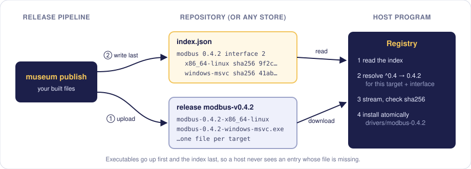
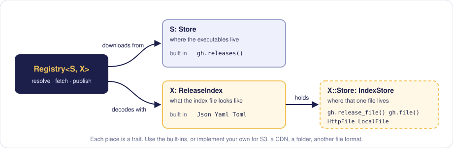

<p align="center">
  
</p>

<h1 align="center">museum</h1>

<p align="center">
  A registry for executables your program downloads at runtime:<br>
  semver resolution, one build per target, verified digests, atomic installs.
</p>

<p align="center">
  <a href="https://crates.io/crates/museum"></a>
  <a href="https://docs.rs/museum"></a>
  <a href="https://github.com/vutran1710/museum-rs/actions/workflows/publish.yml"></a>
  
</p>

Your program runs plugins, drivers or agents that ship on their own schedule. Publish them with `museum publish`; your program asks museum for `modbus ^0.4` and gets the right build for its platform, checked and installed.

<p align="center"></p>

## Fetch, from your program

```sh
cargo add museum
```

```rust
use museum::{HOST_TARGET, Json, Options, Registry, VersionReq};
use museum::github::Github;

let gh = Github::new("acme/plugins")?.prefix("acme-");
let index = Json::new(gh.release_file("index/index.json")?);
let registry = Registry::github(&gh, index, Options { download_dir: "drivers".into() })?;

let wanted = [("modbus".to_string(), VersionReq::parse("^0.4")?)];
for (package, fetched) in registry.fetch_all(&wanted, HOST_TARGET, 2).await {
    println!("{package}: {}", fetched?.path.display());   // drivers/modbus-0.4.2
}
```

A public registry needs nothing else. For a private one, pass the header GitHub expects: `Github::new(..)?.headers(..)` with `Authorization: Bearer <token>`.

## Publish, from your pipeline

Get `museum` from the [releases page](https://github.com/vutran1710/museum-rs/releases) (Linux, macOS, Windows), or with `cargo install museum-cli`.

```sh
export GITHUB_TOKEN=$(gh auth token)

museum init --registry https://github.com/acme/plugins --index index.json --prefix acme-   # once
museum publish --package modbus --version 0.4.2 --interface 2 \
  --file x86_64-unknown-linux-gnu=target/release/modbus \
  --file x86_64-pc-windows-msvc=target/x86_64-pc-windows-msvc/release/modbus.exe
```

`init` writes a `museum.toml` to commit. Published versions never change; publishing the same files again does nothing.

## Swap any piece

<p align="center"></p>

GitHub and JSON, YAML, TOML are built in. Implement `Store`, `IndexStore` or `ReleaseIndex` to keep executables on S3, the index on a CDN, or use another file format. [`examples/local_registry.rs`](examples/local_registry.rs) does the whole cycle with a custom store, in about 120 lines.

## What you can rely on

- **Right build:** the newest version matching every requirement for a package, for the exact target triple (`msvc` ≠ `gnu`) and interface version.
- **Intact file:** sha256 checked while streaming; a mismatch or a failed download leaves nothing behind.
- **Atomic install:** the file appears under its real name only once complete; a cached copy is re-hashed before reuse.
- **No museum-specific auth:** access is the store's business, through the headers it already uses.

## More

[API docs](https://docs.rs/museum) · [design notes](docs/design.md) · [examples](examples) · licensed MIT or Apache-2.0
