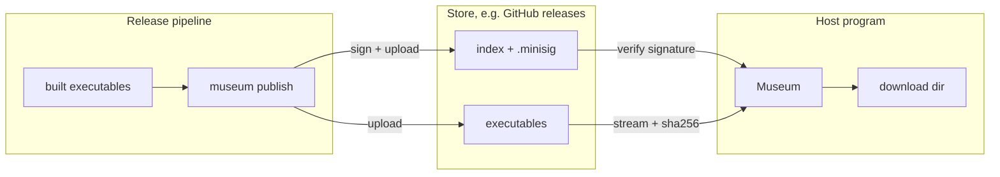

<p align="center">
  
</p>

<h1 align="center">museum</h1>

<p align="center">
  A registry for executables your program downloads at runtime.<br>
  Signed index, semver resolution, per-target builds, atomic installs.
</p>

<p align="center">
  <a href="https://crates.io/crates/museum"></a>
  <a href="https://docs.rs/museum"></a>
  
  
</p>

---

Some programs are extended by other programs. A host starts separate executables (drivers, plugins, agents) that are released on their own schedule, for several platforms. **museum** is the library both sides use:

- **The host** asks for `modbus ^0.4`. museum picks the newest version that fits, has a build for the host's exact target triple and speaks the host's interface version. It then downloads the build, proves it is the file the publisher signed, and installs it atomically.
- **The release pipeline** runs `museum publish`. It adds the new version to the index, refuses to change an already published one, signs the index, and uploads everything.

Where the files live and what the index file looks like are both pluggable. GitHub releases and JSON, YAML and TOML indexes are built in.

## Contents

- [How it works](#how-it-works)
- [Install](#install)
- [Fetching from a host](#fetching-from-a-host)
- [Publishing with the CLI](#publishing-with-the-cli)
- [Bring your own store or index](#bring-your-own-store-or-index)
- [Guarantees](#guarantees)
- [Registry layout on GitHub](#registry-layout-on-github)
- [Examples](#examples)
- [Features](#features)
- [Development](#development)

## How it works



`Museum<S, X>` is the one type a host touches. It has two type parameters:

| Parameter | Trait | Decides | Built in |
|---|---|---|---|
| `S` | `Store` | where the bytes live and how access is obtained | `GithubPublic` (anonymous), `GithubApi` (token, also writes) |
| `X` | `ReleaseIndex` | the format of the index file | `JsonIndex`, `YamlIndex`, `TomlIndex` |

Everything that must hold for every store and every format lives in the core, written once: bootstrapping access, signature checks, version resolution, hashing, the download cache and atomic installs.

## Install

```sh
cargo add museum                 # the library
cargo install museum-cli         # the `museum` command for release pipelines
```

## Fetching from a host

```rust
use std::time::Duration;

use museum::{HOST_TARGET, JsonIndex, Museum, Options, PublicKey, VersionReq};
use museum::github::{GITHUB, GithubPublic, reqwest};

// The publisher's public key: one of `public_keys` in the museum.toml that `museum init` wrote.
const PUBLISHER_KEY: &str = "RW...";

#[tokio::main]
async fn main() -> Result<(), Box<dyn std::error::Error>> {
    let client = reqwest::Client::builder().timeout(Duration::from_secs(30)).build()?;
    let store = GithubPublic::new(client, GITHUB, "acme", "plugins").prefix("acme-");
    let options = Options {
        trusted_keys: vec![PublicKey::from_base64(PUBLISHER_KEY)?],
        download_dir: "drivers".into(), // relative paths resolve against the current directory, once
    };
    let museum = Museum::new(store, JsonIndex::default(), options)?;

    let wanted = [
        ("modbus".to_string(), VersionReq::parse("^0.4")?),
        ("modbus".to_string(), VersionReq::parse(">=0.4.1")?), // merged with the line above
        ("opcua".to_string(), VersionReq::STAR),
    ];
    for (package, fetched) in museum.fetch_all(&wanted, HOST_TARGET, 2).await {
        println!("{package}: {:?}", fetched.map(|f| f.path));
    }
    Ok(())
}
```

What `fetch_all` does:

1. Bootstraps the store once and shares the session. If the store answers "unauthorized", museum bootstraps again once and retries.
2. Downloads the index and its signature once, verifies the signature against your trusted keys, then decodes the index.
3. Resolves **one version per package** that satisfies every requirement for that package. Two requirements that no single version satisfies give `Unresolvable::Conflict`.
4. Downloads each package once, in parallel, into `<package>-<version>[.exe]`, and returns typed errors you can match on.

`HOST_TARGET` is Cargo's exact target triple, so `x86_64-pc-windows-msvc` and `x86_64-pc-windows-gnu` are told apart.

## Publishing with the CLI

```sh
# once per registry: creates a signing key, museum.toml and an empty signed index
export GITHUB_TOKEN=$(gh auth token)
export MUSEUM_KEY_PASSWORD=...        # protects the generated secret key
museum init --registry https://github.com/acme/plugins --index index.yaml --prefix acme- \
  --secret-key ~/.config/museum/acme-plugins.key   # keep it out of the repository

# every release
museum publish --package modbus --version 0.4.2 --interface 2 \
  --file x86_64-unknown-linux-gnu=target/x86_64-unknown-linux-gnu/release/modbus \
  --file x86_64-pc-windows-msvc=target/x86_64-pc-windows-msvc/release/modbus.exe
```

`museum init` writes this `museum.toml`. Commit it: it holds only public information.

```toml
registry = "https://github.com/acme/plugins"
index = "index.yaml"
prefix = "acme-"
public_keys = ["RWT..."]                       # give these to your hosts
secret_key = "/home/you/.config/museum/acme-plugins.key"   # a path, never the key
api_url = "https://api.github.com"                  # or a GitHub Enterprise API root
token_env = "GITHUB_TOKEN"
```

`museum publish` verifies the current index, refuses to change a version that is already published, uploads the executables, and uploads the re-signed index last. A host therefore never sees an index entry whose file is missing. Publishing the same files again is a no-op.

The same flow is available from Rust as `Museum::init` and `Museum::publish` for any store that implements `StoreWriter`.

## Bring your own store or index

A store says where bytes live, the index included: the built-in GitHub stores keep it in a release tagged `index`, and another store could read it from a file in the repository, a bucket or a CDN. Bootstrapping is per store type, and only `Museum` calls it.

```rust
use museum::{ByteStream, Location, Object, Store, StoreError};

struct S3Store { /* bucket, client, prefix */ }

impl Store for S3Store {
    type Session = Credentials;  // whatever bootstrap produces
    type Error = S3Error;        // must implement StoreError: unauthorized(), not_found()

    async fn bootstrap(&self) -> Result<Credentials, S3Error> { /* fetch credentials */ }
    async fn open(&self, session: &Credentials, object: Object<'_>) -> Result<ByteStream<S3Error>, S3Error> {
        /* stream the object at self.location(object) */
    }
    fn location(&self, object: Object<'_>) -> Location { /* pure: { group, file } */ }
}
```

An index says what the index file looks like. The value you pass to `Museum::new` is the empty index, which also makes it easy to hand a fake to a test.

```rust
use museum::{Release, ReleaseIndex, Version};

#[derive(Clone)]
struct ProtobufIndex { /* ... */ }

impl ReleaseIndex for ProtobufIndex {
    type Error = DecodeError;
    fn file_name(&self) -> &str { "index.pb" }
    fn decode(&self, bytes: &[u8]) -> Result<Self, DecodeError> { /* ... */ }
    fn encode(&self) -> Result<Vec<u8>, DecodeError> { /* ... */ }
    fn packages(&self) -> Vec<String> { /* ... */ }
    fn releases(&self, package: &str) -> Vec<(Version, Release)> { /* ... */ }
    fn insert(&mut self, package: &str, version: Version, release: Release) { /* ... */ }
}

let museum = Museum::new(S3Store::new(), ProtobufIndex::default(), options)?;
```

Errors stay typed all the way: `MuseumError<S, X>` carries your store's and your index's own error types, so a host can match on them.

## Guarantees

| Guarantee | How |
|---|---|
| The index came from the publisher | minisign (Ed25519) signature over the raw index bytes, checked before decoding. Several trusted keys are accepted, so a key can be rotated. A missing signature is refused; there is no unsigned fallback. |
| A file is the one the index lists | sha256 is computed while streaming, and compared before the file gets its real name. |
| A failed download leaves nothing runnable | Bytes land in `<name>.part` and are renamed into place only after the digest matches. Every failure path removes the `.part`. |
| Cached files are not trusted blindly | An existing file is re-hashed. A damaged or different build is downloaded again and overwritten. |
| Published versions are immutable | `publish` refuses a version that exists with different files. |
| Executables run on Unix | Installed with mode `0755`. |

Not covered in this version: rollback protection, meaning an attacker serving an older but validly signed index.

## Registry layout on GitHub

```
index release        tag `index`              index.json (or .yaml/.toml) + index.json.minisig
executable release   tag `<package>-v<version>`   <prefix><package>-<version>-<target>[.exe]
```

`.exe` is added when the **target** contains `windows`, so a Linux pipeline can publish Windows builds. One repository can host several registries at once as long as their index files and prefixes differ. This repository does exactly that for its examples.

The index is one map `package → version → release`:

```yaml
modbus:
  0.4.2:
    interface: 2
    targets:
      x86_64-pc-windows-msvc:    { sha256: 9f2c..., size_bytes: 7340032 }
      aarch64-unknown-linux-gnu: { sha256: 41ab..., size_bytes: 6815744 }
```

## Examples

This repository's own releases host two example registries side by side, one with a JSON index and one with a YAML index. Each publishes the `hello` example program.

```sh
cargo run --example fetch_json --features github,json,toml
cargo run --example fetch_yaml --features github,yaml,toml
```

Each example fetches `hello` for your platform, verifies it, and runs it. Builds are published for macOS (`aarch64-apple-darwin`, `x86_64-apple-darwin`).

## Features

| Feature | Default | Adds |
|---|---|---|
| `github` | yes | `GithubPublic`, `GithubApi`, `GithubConfig` |
| `json` | yes | `JsonIndex` |
| `yaml` | | `YamlIndex` |
| `toml` | | `TomlIndex` |

The core (traits, resolution, fetching, publishing) needs no feature.

## Development

```sh
cargo +nightly fmt --all                                       # rustfmt.toml uses nightly options
cargo clippy --workspace --all-targets --all-features -- -D warnings
cargo test --workspace --all-features
cargo llvm-cov --workspace --all-features --fail-under-lines 100
```

Every test is a parameterised `rstest` table. The GitHub stores and the CLI are tested against a real local HTTP server, never a mocked client.

## License

Licensed under either of [Apache License, Version 2.0](LICENSE-APACHE) or [MIT license](LICENSE-MIT), at your option.
