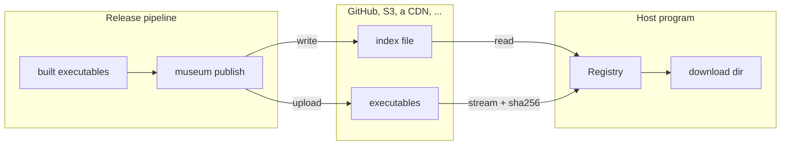

<p align="center">
  
</p>

<h1 align="center">museum</h1>

<p align="center">
  A registry for executables your program downloads at runtime.<br>
  Semver resolution, per-target builds, verified digests, atomic installs.
</p>

<p align="center">
  <a href="https://crates.io/crates/museum"></a>
  <a href="https://docs.rs/museum"></a>
  
  
</p>

---

Some programs are extended by other programs. A host starts separate executables (drivers, plugins, agents) that are released on their own schedule, for several platforms. **museum** is the library both sides use:

- **The host** asks for `modbus ^0.4`. museum picks the newest version that fits, has a build for the host's exact target triple and speaks the host's interface version. It then downloads the build, checks it against the digest the index lists, and installs it atomically.
- **The release pipeline** runs `museum publish`. It adds the new version to the index, refuses to change an already published one, and uploads everything.

Where the executables live, where the index lives, and what the index file looks like are three separate choices. GitHub, JSON, YAML and TOML are built in; each can be replaced by your own type. museum adds no access layer of its own: reading a public registry needs nothing, and private reads and writes use whatever the store already requires, such as a GitHub token.

## Contents

- [How it works](#how-it-works)
- [Install](#install)
- [Fetching from a host](#fetching-from-a-host)
- [Publishing with the CLI](#publishing-with-the-cli)
- [Bring your own store, index store or format](#bring-your-own-store-index-store-or-format)
- [Guarantees](#guarantees)
- [Layout on GitHub](#layout-on-github)
- [Examples](#examples)
- [Features](#features)
- [Development](#development)

## How it works



`Registry<S, X>` is the one type a host touches.

| Piece | Trait | Decides | Built in |
|---|---|---|---|
| `S` | `Store` | where the executables live and how access is obtained | `GithubReleases` |
| `X` | `ReleaseIndex` | the format of the index file | `Json`, `Yaml`, `Toml` |
| `X::Store` | `IndexStore` | where that one index file lives | `gh.release_file("<tag>/<name>")`, `gh.file("<ref>/<path>")`, `HttpFile`, `LocalFile` |

Everything that must hold for every combination lives in the core, written once: bootstrapping access, version resolution, digest checks, the download cache and atomic installs.

## Install

```sh
cargo add museum                 # the library
cargo install museum-cli         # the `museum` command for release pipelines
```

## Fetching from a host

```rust
use museum::{HOST_TARGET, Json, Options, Registry, VersionReq};
use museum::github::Github;

#[tokio::main]
async fn main() -> Result<(), Box<dyn std::error::Error>> {
    let gh = Github::new("acme/plugins")?.prefix("acme-");
    let index = Json::new(gh.file("main/registry/index.json")?);   // or gh.release_file("index/index.json")?
    let registry = Registry::github(&gh, index, Options { download_dir: "drivers".into() })?;

    let wanted = [
        ("modbus".to_string(), VersionReq::parse("^0.4")?),
        ("modbus".to_string(), VersionReq::parse(">=0.4.1")?), // merged with the line above
        ("opcua".to_string(), VersionReq::STAR),
    ];
    for (package, fetched) in registry.fetch_all(&wanted, HOST_TARGET, 2).await {
        println!("{package}: {:?}", fetched.map(|f| f.path));
    }
    Ok(())
}
```

A private repository only needs the header GitHub expects; nothing else changes:

```rust
use museum::github::reqwest::header::{AUTHORIZATION, HeaderMap, HeaderValue};

let auth = HeaderValue::from_str(&format!("Bearer {}", std::env::var("GITHUB_TOKEN")?))?;
let gh = Github::new("acme/private-plugins")?.headers(HeaderMap::from_iter([(AUTHORIZATION, auth)]));
```

What `fetch_all` does:

1. Reads the index file from its store once, and decodes it.
2. Resolves **one version per package** that satisfies every requirement for that package. Two requirements that no single version satisfies give `Unresolvable::Conflict`.
3. Bootstraps the executables store once and shares the session. If the store answers "unauthorized", museum bootstraps again once and retries.
4. Downloads each package once, in parallel, into `<package>-<version>[.exe]`, checks its sha256, and returns typed errors you can match on.

`HOST_TARGET` is Cargo's exact target triple, so `x86_64-pc-windows-msvc` and `x86_64-pc-windows-gnu` are told apart. A relative `download_dir` is resolved against the current directory once, in `Registry::new`. To set a timeout or proxy, pass your own client: `Github::new(..)?.client(reqwest_client)`.

## Publishing with the CLI

```sh
export GITHUB_TOKEN=$(gh auth token)

# once per registry: writes museum.toml and an empty index
museum init --registry https://github.com/acme/plugins --index index.yaml --prefix acme-
  # add --index-branch main to commit the index to the repository instead of the `index` release

# every release
museum publish --package modbus --version 0.4.2 --interface 2 \
  --file x86_64-unknown-linux-gnu=target/x86_64-unknown-linux-gnu/release/modbus \
  --file x86_64-pc-windows-msvc=target/x86_64-pc-windows-msvc/release/modbus.exe
```

`museum init` writes this `museum.toml`. Commit it: it holds only public, portable settings.

```toml
registry = "https://github.com/acme/plugins"
index = "index.yaml"
prefix = "acme-"
api_url = "https://api.github.com"     # or a GitHub Enterprise API root
token_env = "GITHUB_TOKEN"             # the variable holding the token sent as `Authorization`
# index_branch = "main"                # index committed to the repository
```

`museum publish` reads the current index, refuses to change a version that is already published, uploads the executables, and writes the updated index last. A host therefore never sees an index entry whose file is missing. Publishing the same files again is a no-op.

The same flow is available from Rust as `Registry::init` and `Registry::publish`; see [`examples/local_registry.rs`](examples/local_registry.rs).

## Bring your own store, index store or format

**A store** says where executables live. Bootstrapping is per store type, and only `Registry` calls it. Implement `StoreWriter` too if `publish` should upload to it.

```rust
use museum::{Artifact, ByteStream, Location, Store};

struct S3Releases { /* bucket, client, prefix */ }

impl Store for S3Releases {
    type Session = Credentials;  // whatever bootstrap produces
    type Error = S3Error;        // implements StoreError: unauthorized(), not_found()

    async fn bootstrap(&self) -> Result<Credentials, S3Error> { /* fetch credentials */ }
    async fn open(&self, session: &Credentials, artifact: Artifact<'_>) -> Result<ByteStream<S3Error>, S3Error> {
        /* stream the object at self.location(artifact) */
    }
    fn location(&self, artifact: Artifact<'_>) -> Location { /* pure: { group, file } */ }
}
```

**An index store** finds and keeps one index file.

```rust
use museum::IndexStore;

#[derive(Clone)]
struct S3File { /* bucket, key */ }

impl IndexStore for S3File {
    type Error = S3Error;        // implements IndexError: not_found()
    async fn read(&self) -> Result<Vec<u8>, S3Error> { /* the file's bytes */ }
    async fn write(&self, index: Vec<u8>) -> Result<String, S3Error> { /* returns where it went */ }
}
```

**A format** is a file format and nothing else. It holds the index store it lives in, and the value you pass to `Registry::new` is the empty index.

```rust
use museum::{Release, ReleaseIndex, Version};

#[derive(Clone)]
struct Protobuf<S> { store: S, /* releases */ }

impl<S: IndexStore> ReleaseIndex for Protobuf<S> {
    type Store = S;
    type Error = DecodeError;
    fn store(&self) -> &S { &self.store }
    fn decode(&self, bytes: &[u8]) -> Result<Self, DecodeError> { /* ... */ }
    fn encode(&self) -> Result<Vec<u8>, DecodeError> { /* ... */ }
    fn packages(&self) -> Vec<String> { /* ... */ }
    fn releases(&self, package: &str) -> Vec<(Version, Release)> { /* ... */ }
    fn insert(&mut self, package: &str, version: Version, release: Release) { /* ... */ }
}

let registry = Registry::new(S3Releases::new(), Protobuf::new(S3File::new()), options)?;
```

Errors stay typed all the way: `RegistryError<S, X>` carries your store's, your format's and your index store's own error types, so a host can match on them.

## Guarantees

| Guarantee | How |
|---|---|
| A file is the one the index lists | sha256 is computed while streaming, and compared before the file gets its real name. |
| A failed download leaves nothing runnable | Bytes land in `<name>.part` and are renamed into place only after the digest matches. Every failure path removes the `.part`. |
| Cached files are not trusted blindly | An existing file is re-hashed. A damaged or different build is downloaded again and overwritten. |
| Published versions are immutable | `publish` refuses a version that exists with different files. |
| Executables run on Unix | Installed with mode `0755`. |

Who may read or write is the store's business. museum checks integrity, not authorship: anyone who can write to the store can change both an executable and its digest.

## Layout on GitHub

```
executables     release `<package>-v<version>`     asset <prefix><package>-<version>-<target>[.exe]
index           gh.release_file("<tag>/<name>")    asset <name> of release <tag>
                gh.file("<ref>/<path>")            <path> at a branch, tag or commit
```

The repository is given once, to `Github::new("owner/repo")`. In `gh.file(..)` the first segment is the ref, so a branch whose name contains `/` cannot be addressed this way. With an `Authorization` header, release assets are read through GitHub's API (private repositories need this); without one they are downloaded directly.

`.exe` is added when the **target** contains `windows`, so a Linux pipeline can publish Windows builds. One repository can host several registries at once as long as their index files and prefixes differ. This repository does exactly that for its examples.

The built-in formats share one model, `package → version → release`:

```yaml
modbus:
  0.4.2:
    interface: 2
    targets:
      x86_64-pc-windows-msvc:    { sha256: 9f2c..., size_bytes: 7340032 }
      aarch64-unknown-linux-gnu: { sha256: 41ab..., size_bytes: 6815744 }
```

## Examples

| Example | Shows |
|---|---|
| [`local_registry`](examples/local_registry.rs) | The library end to end, with no network: a custom `Store` keeping executables in a folder, a `Yaml` index in a `LocalFile`, then `init`, `publish` and `fetch_all` from Rust. |
| [`fetch_json`](examples/fetch_json.rs), [`fetch_yaml`](examples/fetch_yaml.rs) | A host reading the two example registries hosted side by side in this repository's own releases: it fetches `hello` for your platform, checks its digest, and runs it. |

```sh
cargo run --example local_registry --features yaml
cargo run --example fetch_json --features github,json,toml
cargo run --example fetch_yaml --features github,yaml,toml
```

The example registries publish `hello` for macOS only (`aarch64-apple-darwin`, `x86_64-apple-darwin`); on other platforms `fetch_*` reports that there is no build for your target.

## Features

| Feature | Default | Adds |
|---|---|---|
| `github` | yes | `Github`, `GithubReleases`, `GithubReleaseFile`, `GithubFile`, `HttpFile`, `GithubConfig`, `RepoAddress`, `FileAddress` |
| `json` | yes | `Json` |
| `yaml` | | `Yaml` |
| `toml` | | `Toml` |

The core (traits, `LocalFile`, resolution, fetching, publishing) needs no feature.

## Development

```sh
cargo +nightly fmt --all                                       # rustfmt.toml uses nightly options
cargo clippy --workspace --all-targets --all-features -- -D warnings
cargo test --workspace --all-features
cargo llvm-cov --workspace --all-features --fail-under-lines 100
```

Every test is a parameterised `rstest` table. The GitHub stores and the CLI are tested against a real local HTTP server, never a mocked client.

## License

Licensed under either of [Apache License, Version 2.0](LICENSE-APACHE) or [MIT license](LICENSE-MIT), at your option.
